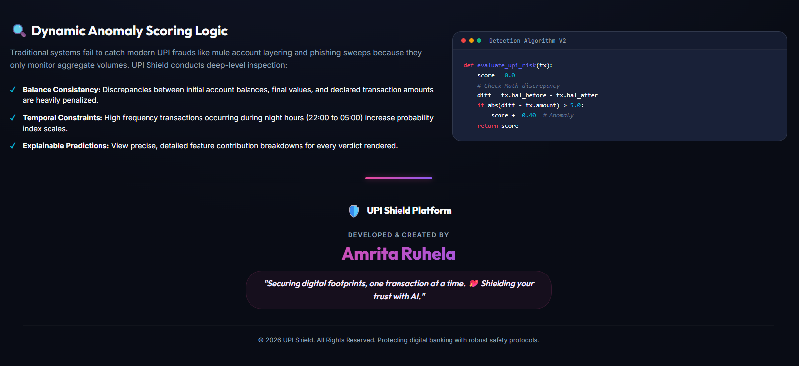
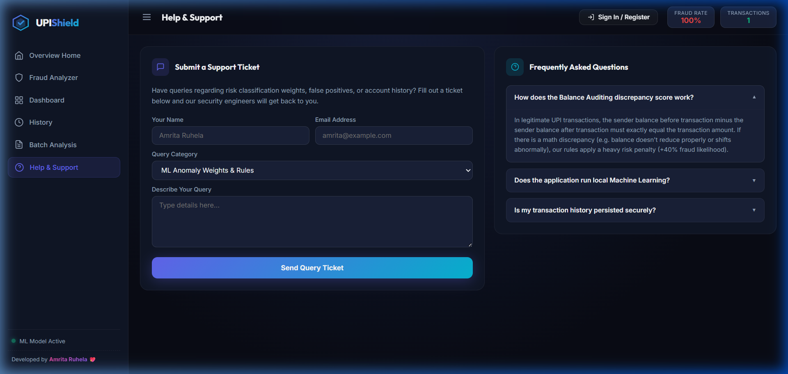
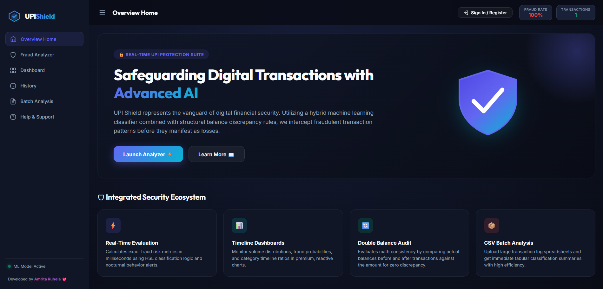

<div align="center">


<br/><br/>

```
 ██╗   ██╗██████╗ ██╗    ███████╗██╗  ██╗██╗███████╗██╗     ██████╗ 
 ██║   ██║██╔══██╗██║    ██╔════╝██║  ██║██║██╔════╝██║     ██╔══██╗
 ██║   ██║██████╔╝██║    ███████╗███████║██║█████╗  ██║     ██║  ██║
 ██║   ██║██╔═══╝ ██║    ╚════██║██╔══██║██║██╔══╝  ██║     ██║  ██║
 ╚██████╔╝██║     ██║    ███████║██║  ██║██║███████╗███████╗██████╔╝
  ╚═════╝ ╚═╝     ╚═╝    ╚══════╝╚═╝  ╚═╝╚═╝╚══════╝╚══════╝╚═════╝ 
```

# 🛡️ UPI Shield — AI-Powered Fraud Detection System

### *Safeguarding Digital Transactions with Advanced Machine Learning*

> **"Securing digital footprints, one transaction at a time. 💖 Shielding your trust with AI."**
> — *Amrita Ruhela*

<br/>

</div>

---

## 📸 Application Screenshots

<div align="center">

### 🏠 Overview Home — Landing Dashboard


### 🔍 Fraud Analyzer — Real-Time Detection Engine


### 📊 Analytics Dashboard


</div>

---

## 📖 Table of Contents

- [Overview](#-overview)
- [Key Features](#-key-features)
- [Live Demo](#-live-demo)
- [Tech Stack](#-tech-stack)
- [System Architecture](#-system-architecture)
- [Detection Algorithm](#-detection-algorithm)
- [Project Structure](#-project-structure)
- [Installation & Setup](#-installation--setup)
- [API Reference](#-api-reference)
- [Usage Guide](#-usage-guide)
- [CSV Batch Analysis](#-csv-batch-analysis)
- [Screenshots](#-application-screenshots)
- [Author](#-author--credits)
- [License](#-license)

---

## 🌐 Overview

**UPI Shield** is a full-stack, production-grade AI fraud detection system built specifically for the **Unified Payments Interface (UPI)** ecosystem — India's most widely used digital payments network.

In 2024 alone, UPI processed over **₹200 trillion** in transactions. With this scale comes an ever-growing surface area for financial fraud — including phishing sweeps, mule account layering, and nocturnal high-frequency attacks.

UPI Shield intercepts these threats using a **hybrid dual-engine** approach:
1. A **trained Random Forest ML Classifier** (if `model.pkl` is present)
2. A **deterministic rule-based fallback engine** using weighted mathematical heuristics

Both engines produce identical output formats — ensuring seamless operation with or without a trained model.

---

## ✨ Key Features

| Feature | Description |
|---|---|
| ⚡ **Real-Time Scoring** | Instant fraud risk score (0–100%) per transaction in milliseconds |
| 🧠 **Dual-Engine AI** | Random Forest ML or rule-based fallback — always operational |
| 📊 **Interactive Dashboard** | Live KPI cards, doughnut charts, timeline graphs, and amount distribution bars |
| 🔍 **Explainable AI (XAI)** | Per-feature SHAP-style contribution scores for every verdict |
| 📦 **CSV Batch Processing** | Upload entire transaction logs — get classification summaries instantly |
| 🕐 **Transaction History** | Full searchable, filterable transaction log with fraud/legit badges |
| 🌙 **Temporal Anomaly Detection** | Night-hour transactions (22:00–05:00) flagged with elevated risk |
| 💡 **Quick Scenarios** | One-click pre-loaded test cases: Legit, Suspicious, Night, High Value |
| 🎨 **Premium Dark UI** | Glassmorphism design with smooth animations and micro-interactions |
| 📱 **Fully Responsive** | Works seamlessly across desktop, tablet, and mobile |

---

## 🚀 Live Demo

> Start the application locally by following the [Installation Guide](#-installation--setup) below.
> 
> Once running, visit: **[http://127.0.0.1:5000](http://127.0.0.1:5000)**

---

## 🛠️ Tech Stack

### Backend
| Technology | Purpose |
|---|---|
| **Python 3.8+** | Core language |
| **Flask 2.x** | Lightweight web framework & REST API server |
| **scikit-learn** | Random Forest Classifier for ML predictions |
| **NumPy** | Feature vector construction and numerical computation |
| **pickle** | Model serialization and loading |

### Frontend
| Technology | Purpose |
|---|---|
| **HTML5 / CSS3** | Semantic markup and premium dark-mode styling |
| **Vanilla JavaScript (ES6+)** | Reactive UI, API calls, state management |
| **Chart.js 4.4** | Interactive Doughnut, Line, and Bar charts |
| **Google Fonts (Inter + Outfit)** | Modern typography |

### Design System
| Element | Implementation |
|---|---|
| **Color Palette** | HSL-tuned dark indigo (`#090c15`), Indigo (`#6366f1`), Cyan (`#06b6d4`) |
| **Animation** | CSS keyframe floating shield, glassmorphism overlays, progress bar transitions |
| **Layout** | CSS Grid + Flexbox, sticky sidebar, responsive breakpoints |

---

## 🏗️ System Architecture

```
┌─────────────────────────────────────────────────────────────────┐
│                        UPI SHIELD SYSTEM                        │
│                                                                 │
│   ┌──────────────┐        ┌──────────────────────────────────┐  │
│   │   Browser    │  HTTP  │         Flask Backend            │  │
│   │   (HTML/JS)  │◄──────►│         (app.py)                │  │
│   └──────────────┘        └──────────────┬───────────────────┘  │
│                                          │                      │
│                               ┌──────────▼──────────┐          │
│                               │   Model Dispatcher   │          │
│                               └──────────┬──────────┘          │
│                                          │                      │
│                    ┌─────────────────────┼──────────────────┐   │
│                    │                     │                  │   │
│           ┌────────▼────────┐   ┌────────▼────────┐         │   │
│           │  ML Engine      │   │  Rule Engine    │         │   │
│           │  (model.pkl)    │   │  (Heuristics)   │         │   │
│           │  Random Forest  │   │  Weight-based   │         │   │
│           └────────┬────────┘   └────────┬────────┘         │   │
│                    └─────────────────────┘                  │   │
│                                          │                  │   │
│                               ┌──────────▼──────────┐       │   │
│                               │   Risk Score +       │       │   │
│                               │   Feature Weights    │       │   │
│                               └──────────┬──────────┘       │   │
│                                          │                  │   │
│                    ┌─────────────────────┼────────────────┐  │   │
│                    │                     │                │  │   │
│           ┌────────▼────────┐   ┌────────▼──────┐         │  │   │
│           │  Dashboard      │   │  History Log  │         │  │   │
│           │  Chart.js       │   │  In-Memory    │         │  │   │
│           └─────────────────┘   └───────────────┘         │  │   │
└─────────────────────────────────────────────────────────────────┘
```

### Data Flow
```
User Input (Form/CSV)
        │
        ▼
Feature Engineering
  ├─ Amount/Balance Ratio
  ├─ Night-time Detection
  ├─ Transaction Frequency
  └─ Type Encoding
        │
        ▼
Model Dispatcher
  ├─ [model.pkl exists?] ──YES──► Random Forest Predict
  └──────────────────────NO───► Rule-Based Heuristics
        │
        ▼
Risk Score (0–100%)
+ Feature Importance
+ Verdict (FRAUD / LEGIT)
+ Risk Level (LOW / MEDIUM / HIGH / CRITICAL)
        │
        ▼
JSON Response → Frontend Renderer → Chart Updates
```

---

## 🔬 Detection Algorithm

### Hybrid Scoring Engine

UPI Shield uses a **7-factor weighted scoring model** when operating in rule-based mode:

| Factor | Weight | Trigger Condition |
|---|---|---|
| 💰 **High Amount** | Up to `+40%` | Amount > ₹1,00,000 |
| ⚖️ **Amount/Balance Ratio** | Up to `+25%` | Ratio > 90% of sender balance |
| 🌙 **Night Transaction** | `+15%` | Transaction between 22:00–05:00 |
| 🔁 **High Frequency** | Up to `+20%` | >10 transactions in last hour |
| 🏦 **Transfer Type** | `+10%` | Transaction type = BANK TRANSFER |
| 💸 **Micro Amount** | `+15%` | Amount < ₹10 (structuring attempt) |
| 📈 **Mid-High Amount** | `+20%` | Amount ₹50K–₹1L |

**Risk Levels:**
```
0%  ──── 30% ──── 50% ──── 75% ──── 100%
 LOW     MEDIUM    HIGH    CRITICAL
```

### ML Model (When Available)
When `model.pkl` is present, the Random Forest Classifier:
- Uses all 10 engineered features as input
- Returns `predict_proba()` for calibrated probability output
- Exposes `feature_importances_` for SHAP-style explainability

---

## 📁 Project Structure

```
UPI-FRAUD-DETECTION/
│
├── app.py                    # Flask backend — routes, prediction engine
├── model.pkl                 # (Optional) Pre-trained Random Forest model
├── requirements.txt          # Python dependencies
├── test_transactions.csv     # Sample batch CSV for testing
│
├── templates/
│   └── index.html            # Single-page dashboard (Jinja2 template)
│
├── static/
│   ├── style.css             # Complete dark-mode design system
│   └── app.js                # Frontend logic, Chart.js, API handlers
│
└── screenshots/
    ├── home_hero.png
    ├── fraud_analyzer.png
    └── dashboard.png
```

---

## ⚙️ Installation & Setup

### Prerequisites
- Python **3.8 or higher**
- pip package manager
- Git (for cloning)

### Step 1 — Clone the Repository
```bash
git clone https://github.com/amritaruhela/UPI-FRAUD-DETECTION.git
cd UPI-FRAUD-DETECTION
```

### Step 2 — Create a Virtual Environment *(Recommended)*
```bash
# Windows
python -m venv venv
venv\Scripts\activate

# macOS / Linux
python3 -m venv venv
source venv/bin/activate
```

### Step 3 — Install Dependencies
```bash
pip install -r requirements.txt
```

### Step 4 — Run the Application
```bash
python app.py
```

### Step 5 — Open in Browser
```
http://127.0.0.1:5000
```

That's it! 🎉 The application will auto-detect if `model.pkl` exists and switch between ML and rule-based modes automatically.

---

## 📦 Requirements

```txt
flask>=2.0.0
numpy>=1.21.0
scikit-learn>=1.0.0
```

Install with:
```bash
pip install flask numpy scikit-learn
```

---

## 📡 API Reference

All endpoints return **JSON** responses.

### `POST /api/predict`
Analyze a single UPI transaction for fraud.

**Request Body:**
```json
{
  "amount": 98000,
  "transaction_type": "TRANSFER",
  "sender_upi": "unknown123@ybl",
  "receiver_upi": "anon456@upi",
  "sender_balance": 100000,
  "receiver_balance": 500,
  "hour": 3,
  "transaction_count_last_hour": 14
}
```

**Response:**
```json
{
  "is_fraud": true,
  "fraud_probability": 87.5,
  "legit_probability": 12.5,
  "risk_level": "CRITICAL",
  "confidence": 87.5,
  "model_used": "Rule-Based Engine",
  "transaction_id": "TXN847291",
  "feature_importance_labeled": [
    { "feature": "Transaction Amount", "importance": 0.35 },
    { "feature": "Amount/Balance Ratio", "importance": 0.25 }
  ]
}
```

---

### `GET /api/history`
Returns the last 50 analyzed transactions.

**Response:**
```json
[
  {
    "id": "TXN847291",
    "timestamp": "2026-05-30 18:22:14",
    "amount": 98000,
    "sender": "unknown123@ybl",
    "receiver": "anon456@upi",
    "transaction_type": "TRANSFER",
    "is_fraud": true,
    "fraud_probability": 87.5,
    "risk_level": "CRITICAL"
  }
]
```

---

### `GET /api/stats`
Returns aggregate fraud statistics for the session.

**Response:**
```json
{
  "total": 12,
  "fraud_count": 5,
  "legit_count": 7,
  "fraud_rate": 41.7,
  "total_amount": 845000,
  "fraud_amount": 390000
}
```

---

### `POST /api/batch`
Upload a CSV file for bulk transaction analysis.

**Request:** `multipart/form-data` with field `file` (`.csv`)

**Required CSV Headers:**
```
amount, transaction_type, sender_balance, receiver_balance, hour, day_of_week, is_weekend, transaction_count
```

**Response:**
```json
{
  "results": [
    { "row": 1, "amount": 5000, "is_fraud": false, "fraud_probability": 12.0, "risk_level": "LOW" },
    { "row": 2, "amount": 150000, "is_fraud": true, "fraud_probability": 91.0, "risk_level": "CRITICAL" }
  ],
  "summary": {
    "total": 4,
    "fraud_detected": 2,
    "fraud_rate": 50.0
  }
}
```

---

## 📘 Usage Guide

### 1. Single Transaction Analysis

1. Navigate to **Fraud Analyzer** from the sidebar
2. Fill in transaction details:
   - **Amount** — transaction value in ₹
   - **Transaction Type** — P2P, P2M, Recharge, or Transfer
   - **Sender / Receiver UPI IDs**
   - **Sender Balance** — account balance before the transaction
   - **Hour of Transaction** — 0–23 format
   - **Transactions in Last Hour** — frequency indicator
3. Click **Analyze Transaction**
4. View the instant verdict in the top panel with risk score gauge and feature breakdown

### 2. Quick Scenarios (One-Click Testing)

| Scenario | Description | Expected Result |
|---|---|---|
| ✅ **Legit Transfer** | Normal ₹1,200 merchant payment at noon | LOW risk |
| 🚨 **Suspicious** | ₹98,000 transfer at 3 AM, 14 txns/hour | CRITICAL risk |
| 🌙 **Night Txn** | ₹25,000 P2P at 2 AM on weekend | HIGH risk |
| 💸 **High Value** | ₹4,90,000 corporate transfer | HIGH risk |

### 3. Dashboard Analytics

Navigate to **Dashboard** to see:
- **KPI Cards** — Total, Fraud count, Legitimate count, Total amount analyzed
- **Fraud vs Legit Doughnut** — Distribution pie chart
- **Risk Score Timeline** — Line chart of last 15 transactions
- **Amount Distribution** — Bar chart bucketed by transaction range

### 4. Transaction History

- Full searchable table with all analyzed transactions
- Filter by: **All / Fraud Only / Legitimate Only**
- Search by: Transaction ID, UPI ID, or amount

---

## 📦 CSV Batch Analysis

Test with the included `test_transactions.csv`:

```csv
amount,transaction_type,sender_balance,receiver_balance,hour,day_of_week,is_weekend,transaction_count
5000,P2P,25000,10000,14,2,0,2
150000,TRANSFER,160000,500,2,6,1,15
200,RECHARGE,1500,10000,10,1,0,1
75000,P2P,80000,100,23,5,1,8
```

1. Go to **Batch Analysis** in the sidebar
2. Drag & drop your CSV or click to browse
3. Click **Analyze All Rows**
4. View per-row results table with summary statistics

---

## 🎨 Design Highlights

- **Glassmorphism** — Frosted glass overlays with backdrop blur effects
- **Floating Shield Animation** — CSS keyframe `float` and `pulse-halo` animations on the hero
- **Color System** — Curated HSL dark palette: `#090c15` bg, `#6366f1` indigo, `#06b6d4` cyan
- **Micro-animations** — Progress bar slides, chart renders, toast slideUp notifications
- **Typography** — Google Fonts `Inter` (body) + `Outfit` (headings) + `JetBrains Mono` (code)
- **Responsive** — CSS Grid layout adapts across 1200px, 1000px, and 700px breakpoints

---

## 🔮 Future Roadmap

- [ ] 🔐 Full user authentication with JWT tokens and persistent database
- [ ] 📧 Email alerts when CRITICAL fraud is detected
- [ ] 🤖 Model retraining pipeline with new flagged transactions
- [ ] 🌐 Deployment to Render / Railway / Vercel for public access
- [ ] 📱 Progressive Web App (PWA) support with offline caching
- [ ] 🔗 Real UPI API integration for live transaction monitoring

---

## 🤝 Contributing

Contributions are warmly welcomed! Here's how:

1. **Fork** the repository
2. **Create** your feature branch: `git checkout -b feature/AmazingFeature`
3. **Commit** your changes: `git commit -m 'Add: AmazingFeature'`
4. **Push** to the branch: `git push origin feature/AmazingFeature`
5. **Open** a Pull Request

---

## 📜 License

Distributed under the **MIT License**.

```
MIT License — Copyright (c) 2026 Amrita Ruhela
Permission is hereby granted, free of charge, to any person obtaining a copy
of this software to use, copy, modify, merge, publish, distribute, sublicense,
and/or sell copies of the Software.
```

---

## 👩‍💻 Author & Credits

<div align="center">

```
╔══════════════════════════════════════════════════════╗
║                                                      ║
║            🛡️  UPI SHIELD PLATFORM  🛡️              ║
║                                                      ║
║              DEVELOPED & CREATED BY                  ║
║                                                      ║
║               ✨ Amrita Ruhela ✨                     ║
║                                                      ║
║   "Securing digital footprints, one transaction      ║
║    at a time. 💖 Shielding your trust with AI."      ║
║                                                      ║
║        © 2026 UPI Shield. All Rights Reserved.       ║
║                                                      ║
╚══════════════════════════════════════════════════════╝
```

[](https://github.com/amritaruhela)

</div>

---

<div align="center">

**⭐ If this project helped you, please give it a star on GitHub! ⭐**

*Built with 💖 and a passion for digital security*

</div>
